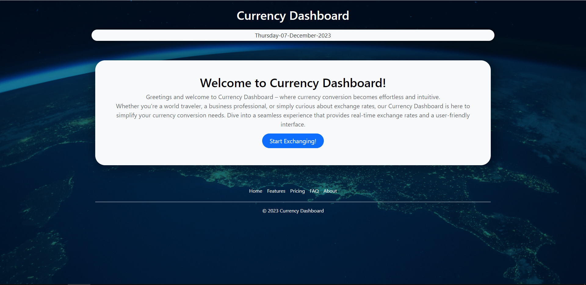
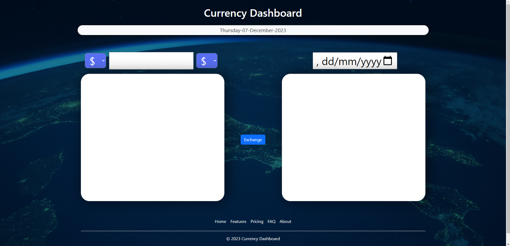
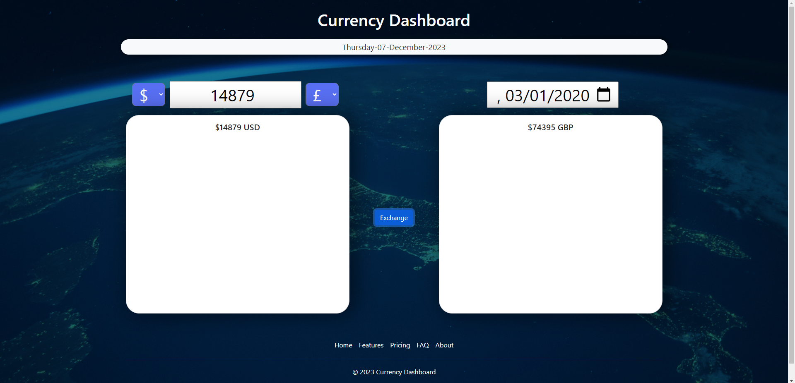

# currency-dashboard

## Table of Contents
* [Screenshot of page](#screenshot)
* [Information](#information)
* [Installation](#installation)
* [Credits](#credits)
* [License](#license)
* [Tests](#tests)

## Screenshot

## Information
The Currency Converter is a website that allows users to convert values from one currency to another. The program currently supports two different currencies: dollars and sterling. Users can select the currency they want to convert from and enter a value to have it converted into the other currency. The program uses real-time exchange rates to ensure that the conversions are accurate and up-to-date.

The Currency Converter is built using JavaScript and is designed to be user-friendly and easy to use. It is ideal for anyone who needs to convert currencies on a regular basis, such as business owners, travelers, or anyone who makes transactions online.

The program currently only supports 2 different currencies. However, we are working on adding more

## Installation
Click on this link:

## Credits

## License
MIT License

Copyright (c) [2023] [Abdul Rehman]

Permission is hereby granted, free of charge, to any person obtaining a copy of this software and associated documentation files (the "Software"), to deal in the Software without restriction, including without limitation the rights to use, copy, modify, merge, publish, distribute, sublicense, and/or sell copies of the Software, and to permit persons to whom the Software is furnished to do so, subject to the following conditions:

The above copyright notice and this permission notice shall be included in all copies or substantial portions of the Software.

THE SOFTWARE IS PROVIDED "AS IS", WITHOUT WARRANTY OF ANY KIND, EXPRESS OR IMPLIED, INCLUDING BUT NOT LIMITED TO THE WARRANTIES OF MERCHANTABILITY, FITNESS FOR A PARTICULAR PURPOSE AND NONINFRINGEMENT. IN NO EVENT SHALL THE AUTHORS OR COPYRIGHT HOLDERS BE LIABLE FOR ANY CLAIM, DAMAGES OR OTHER LIABILITY, WHETHER IN AN ACTION OF CONTRACT, TORT OR OTHERWISE, ARISING FROM, OUT OF OR IN CONNECTION WITH THE SOFTWARE OR THE USE OR OTHER DEALINGS IN THE SOFTWARE.

## Tests
Click the Start Exchanging! button. Ensure the next screen pops up
Enter a value into the text box
Enter a value into the date input box
Click the Exchange button. Ensure the correct values appear on the text boxes
Enter a new value into the text box
Enter a new value into the date input box
Change the currencies used
Click the Exchange button. Ensure the correct values appear on the text boxes